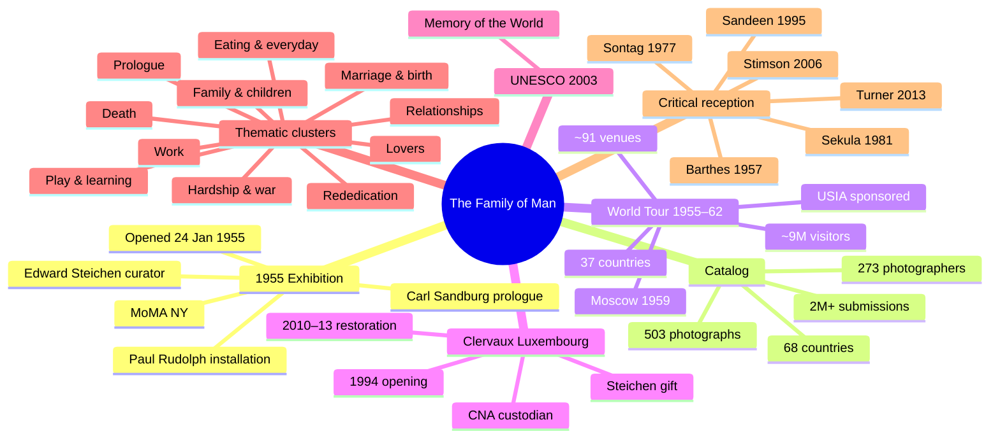

> **Note.** This document was last bumped on 2026-04-19 after PR #3 (thematic clusters) merged and PR #4 (catalog plates 1–47) opened for review.

# Research mindmap

A living map of **what we know** (with sources) and **what we need to investigate** (gaps). Update this file after every merged research PR and whenever a new gap is identified.

## Overview (Mermaid)

---

## What we know (with sources)

### Exhibition — 1955 MoMA
- **Opened 24 January 1955** at the Museum of Modern Art, New York. *Source: MoMA exhibition record #2429.*
- **Curator: Edward Steichen**, then Director of MoMA's Department of Photography.
- **Installation design: Paul Rudolph** (architect). *Source: MoMA Archives / archive-highlights page.*
- **Prologue: Carl Sandburg** (Steichen's brother-in-law), distributed as a leaflet at the entrance.
- **Scale: 503 photographs by 273 photographers from 68 countries.** *Citation status: not yet verified to pagination of the 1955 catalog in this repo; MoMA's public 2429 record is currently unreachable from our fetcher (confirmation needed before cite).*
- **Selection process** — figure of "~2 million submissions" is commonly cited but **not yet verified**; Wikipedia's published figure of ~4 million refers to the *book* submission pool rather than the exhibition. Do not use either figure without a primary-source citation (1955 catalog or Steichen's writings).
- **Entrance arch / crowd imagery opens the show.** *Source: MoMA archive-highlights page.*
- **Closing image: W. Eugene Smith, *A Walk to Paradise Garden* (1946).** *Source: MoMA archive-highlights page.*

### Thematic structure *(merged via PR #3)*
- The 1955 catalog does **not** present a canonical numbered list of sections. Scholarly reconstructions differ: UNESCO Memory of the World register gives "32 themes" (confirmed). A "37 themes" figure is reported on CNA Luxembourg's education portal but is **not yet independently verified** in this repo (CNA site was unreachable during the 2026-04-19 audit).
- **Our working reconstruction: 11 thematic clusters** (`sec-prologue` through `sec-rededication-future`) are live on the site under [/sections/](https://danlex.github.io/thefamilyofman/sections/). Each row in `data/sections.csv` is tagged "thematic cluster reconstructed" to avoid implying canonical status.
- **Governance note:** PR #3 was merged before the four-judge panel ran. The content should be re-audited — especially Judge-Grounding on the Barthes verbatim quotes and Judge-Bias on the theme-count treatment.

### Catalog — first rows seeded (PR #4 open)
- **New anchor source identified: MoMA Master Checklist for Exhibition #569** (`src-moma-exh-0569-master-checklist`, Tier 1). This 26-page internal checklist from MoMA Exhibitions is what PR #4 uses for every row — it gives per-plate photographer, agency/publication, nationality, "where taken," and print dimensions verbatim.
- **Plates 1–50 contain 47 photographs, not 50.** The MoMA Master Checklist skips numbers 5, 7, and 8 in the Prologue section — no explanation given in the document (possible withdrawal, reserved numbering, or internal edit). Our row ids `photo-0001`…`photo-0047` compact the gap.
- **The MoMA Master Checklist records no titles and no dates for individual plates.** Steichen deprived the images of titles (per CNA education portal). Plate years are absent from the primary source. Any year or title we add to a photograph row must be backed by a separate Tier-1/2 citation — secondary identifications (e.g., Bullock's *Let There Be Light* = plate 2) are preserved only in `notes` with a "reported, not primary-verified" caveat.
- **The 7 subsections of the checklist** (Prologue, Lovers, Marriage, Pregnancy, Childbirth, Nursing Mothers, Births) map into 4 of our 11 thematic clusters (`sec-prologue`, `sec-lovers`, `sec-marriage-birth`, `sec-family-children`). Per-row mapping is documented in the CSV `notes` column.
- **National attribution is preserved verbatim** from the checklist — Capa is listed "American," Erwitt "American," Horvat "Italian," even where later scholarly convention differs. Any re-framing is a separate editorial decision, not a silent correction.

### World tour 1955–1962
- **Sponsor: United States Information Agency (USIA).** Records held at National Archives, RG 306.
- **Commonly cited figures: ~91 venues, ~37 countries, ~9M visitors.** *Citation status: widely repeated but not yet verified to Tier-1 primary records in this repo.*
- **Notable stop: Moscow 1959 (Sokolniki Park, American National Exhibition).** *Citation status: attested, not yet formally sourced in this repo.*

### Clervaux (Luxembourg)
- **Permanent installation since 1994** at Clervaux Castle.
- **Custodian: Centre national de l'audiovisuel (CNA).** *Source: steichencollections.lu; cna.public.lu.*
- **Restoration campaign: 2010–2013.** *Citation status: reported by CNA, not yet formally sourced in this repo.*
- **Inscribed on UNESCO Memory of the World: 2003.** *Source: UNESCO register.*

### Critical reception — major landmarks
- **Roland Barthes, "The Great Family of Man"** (in *Mythologies*, 1957). Foundational critique: universalist humanism flattens history and politics. *Verbatim text extracted from a university-hosted PDF via PR #3.*
- **Susan Sontag, *On Photography*** (1977). Related sentimentalism critique.
- **Allan Sekula, "The Traffic in Photographs"** — Marxist ideological reading. *Citation status: widely attributed to* Art Journal *1981, but volume/issue/pages are not yet verified in this repo.*
- **Eric Sandeen, *Picturing an Exhibition: The Family of Man and 1950s America*** (U. New Mexico Press, 1995). Standard historical study; complicates both defense and critique.
- **Blake Stimson, *The Pivot of the World*** (MIT Press, 2006). Re-reads the show within post-war photographic modernism.
- **Fred Turner, *The Democratic Surround*** (U. Chicago Press, 2013). Liberal-democratic design culture.

---

## What we need to investigate (prioritized gaps)

### P0 — foundational (blocks everything else)
- **Catalog — plates 48–503** (remaining after PR #4's first 47). Continue with the MoMA Master Checklist sections: Pregnancy, Childbirth, Nursing Mothers, Births, and onward through the rest of the show.
- **Plate titles and dates** — the Master Checklist has neither. We need the *printed 1955 catalog* (the book) or Steichen's curatorial correspondence to attach titles and years to plates. Expected primary source: the Luxembourg National Library or a Google Books preview of the catalog; the Internet Archive scans were access-restricted.
- **Verbatim Sandburg prologue text with page numbers.** Same blocker as above — access to a scan of the 1955 catalog.
- **Canonical source for exhibition-level figures** (503, 273, 68, ~2M submissions) traced to specific pages of the 1955 catalog, not MoMA's summary pages.

### P1 — core (phase 2)
- **273 photographer biographies.** Each needs dates, nationality, and a Tier-1/2 source for inclusion.
- **1955 installation specifics** — photograph sizes, layout, visitor flow. Paul Rudolph's drawings at MoMA Archives.
- **Opening reception** — contemporary reviews in *New York Times*, *Art News*, *Aperture*, 1955–56. Attendance figures for the MoMA run.
- **World tour venue-by-venue list** — venues, host institutions, dates, attendance. Primary source: USIA records, National Archives RG 306.
- **Moscow 1959** — confirm dates, location (Sokolniki), visitor figures, press reception.
- **Luxembourg provenance chain** — Steichen's deed of gift (date and terms), storage before 1994, exact 1994 opening details.
- **2010–13 restoration** — lead conservator(s), techniques, scope, funding source.
- **UNESCO nomination file (2003)** — text of the inscription and justification.
- **Critical reception in non-English scholarship** — French and German writing, especially from Clervaux-era CNA.

### P2 — enrichment (phase 3)
- **Per-photograph provenance** for each of the 503 — one article per photograph.
- **Photographer compensation and consent** arrangements.
- **Selection process** — how 2M submissions were cut to 503 (Wayne Miller's role as Steichen's assistant).
- **Exhibition funding and sponsorship** in 1955.
- **Current CNA curatorial practice** — rotation schedule, loans, ongoing conservation.
- **Anniversary events** — 50th (2005), 60th (2015), 70th (2025).

### Language gaps
- **Francophone scholarship** (CNA publications, *Revue des musées de France*, French press 1994–present).
- **Germanophone scholarship** (1994 Clervaux opening press in *Luxemburger Wort*, *Tageblatt*; German reviews).
- **Luxembourgish-language coverage** of Clervaux.

### Methodological gaps
- **Theme-count reconciliation** — UNESCO says 32, CNA says 37, our reconstruction proposes 11. Need a source-by-source treatment.
- **Attribution practice** — where our row cites multiple sources with semicolons, confirm CSV-reader compatibility with all tools (not just `validate_schema.py`).

---

## Active investigations

| # | Title | State | Agent | Notes |
|---|---|---|---|---|
| [#1](https://github.com/danlex/thefamilyofman/issues/1) | Catalog plates 1–50 | `in-progress` | catalog-builder | Worker delivered PR #4; 47 rows seeded. |
| [#2](https://github.com/danlex/thefamilyofman/issues/2) | Thematic sections + prologue | `closed via PR #3` | sections-cartographer | Merged without judge review — re-audit pending. |
| [PR #3](https://github.com/danlex/thefamilyofman/pull/3) | `[#2]` sections PR | `MERGED` | — | Content live at [/sections/](https://danlex.github.io/thefamilyofman/sections/). Judge panel not run. |
| [PR #4](https://github.com/danlex/thefamilyofman/pull/4) | `[#1]` catalog 1–47 | `OPEN` | — | 47 rows, 1 new Tier-1 source (MoMA Master Checklist #569). Judge panel not yet run. |

---

## Update protocol

**Who updates this file:** anyone merging a research PR, and the maintainer when a new gap is identified.

**When to update:**
- After a PR merges that adds to `data/`, `sources/`, or `research/` — move the relevant item from the gaps list to the known list, with its source citation.
- When a judge rejects a claim as unsupported — move the item from known back to gaps with a reason.
- When a new investigation issue opens — add it to the **Active investigations** table.

**How to update:**
- Edit via `✏️ Edit this page` from the published wiki, or directly on GitHub.
- Bump `last_updated` in the frontmatter to today's date.
- PRs to this file go through the judge panel like any other research content.

**What not to put here:**
- Speculation unsupported by any source (use the `notes` column of the affected CSV row, or a research file's own "Open questions" section).
- Long excerpts from sources (those belong in `sources/<decade>/<slug>.md`).
- Photograph- or photographer-level detail (those belong in their respective wiki articles).
